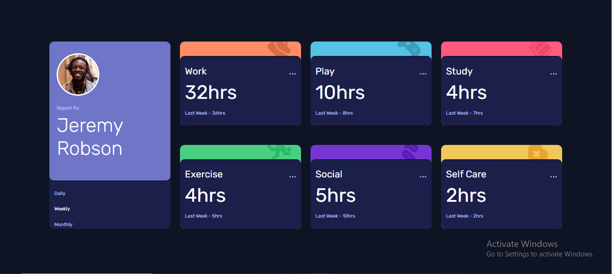
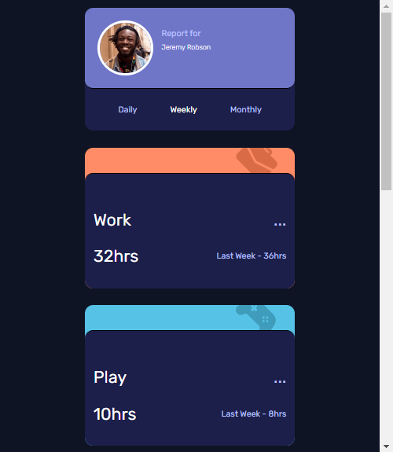

# Frontend Mentor - Time tracking dashboard solution

This is a solution to the [Time tracking dashboard challenge on Frontend Mentor](https://www.frontendmentor.io/challenges/time-tracking-dashboard-UIQ7167Jw).

## Table of contents

- [Overview](#overview)
  - [The challenge](#the-challenge)
  - [Screenshot](#screenshot)
  - [Links](#links)
- [My process](#my-process)
  - [Built with](#built-with)
  - [What I learned](#what-i-learned)
  - [Continued development](#continued-development)
- [Author](#author)

## Overview

### The challenge

Users should be able to:

- View the optimal layout for the site depending on their device's screen size
- See hover states for all interactive elements on the page
- Switch between viewing Daily, Weekly, and Monthly stats

### Screenshot

### Links

- Git Hub Repo URL: [Git Hub URL](https://github.com/KrishnaPoddar1/TimeTrackingDashboard.git)
- Live Site URL: [Live site URL](https://krishnapoddar1.github.io/TimeTrackingDashboard/)

## My process

### Built with

- Semantic HTML5 markup
- CSS custom properties
- Flexbox
- CSS Grid
- Mobile-first workflow
- JavaScript
- JSON
- Visual Studio Code

### What I learned

Utilization of JSON in the project. Even though Some of the things did not work as you can see them commented in the nextFunc(). I utilized the brute force method to solve the challenge. 

### Continued development

Proper utilization of JSON to get data from the server.

## Author

- Frontend Mentor - [@KrishnaPoddar1](https://www.frontendmentor.io/profile/KrishnaPoddar1)
